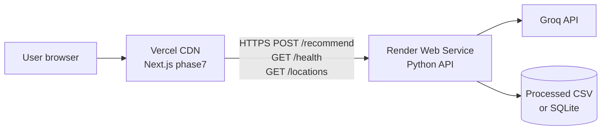

# Deployment Plan: Render (Backend) + Vercel (Frontend)

This plan splits the **AI-Powered Restaurant Recommendation System** into:

| Layer | Platform | What you deploy |
|-------|----------|-----------------|
| **Backend** | [Render](https://render.com) | Python REST API (Groq + Zomato dataset filtering) |
| **Frontend** | [Vercel](https://vercel.com) | Next.js app (`phase7/`) |

**Not on Vercel:** `streamlit_app.py` is Python-only. Keep it local, put it on **Render as a second service**, or use **Streamlit Community Cloud** if you still want that UI in production.

---

## 1. Target architecture



### Request flow (aligned with `d/problemstatment.md`)

1. User sets **Location, Budget, Cuisine, Minimum rating**, optional **additional preferences** in the Vercel UI.
2. Frontend calls Render `POST /recommend`.
3. Backend **filters** `phase1/data/processed/restaurants_processed.csv` (Hugging Face Zomato export).
4. Backend calls **Groq** (Phase 3) to rank and explain.
5. Frontend shows **top 5** recommendations.

---

## 2. Current repo vs production gaps

Before deploying, close these gaps so production matches local Streamlit behavior.

| Area | Today | Needed for Render |
|------|--------|-------------------|
| Recommendation data | `phase4/api_endpoints.py` uses **mock** candidates | Use `phase4/csv_candidates.py` + `load_search_results()` (same as Streamlit) |
| Extra preferences | Supported in Streamlit / `UserPreferences` | Accept `additional_preferences` in API JSON |
| Budget | Streamlit uses numeric `cost_for_two` cap | API should accept `budget` as number (₹) or document mapping |
| Locations list | Streamlit `load_dataset_cities()` | Add `GET /locations` returning distinct `city` values from CSV |
| Flask async routes | `@app.route` with `async def` | Use sync handlers + `asyncio.run()`, or **FastAPI** + uvicorn (recommended on Render) |
| CORS | Partial / blueprint-only | Allow Vercel origin(s) on all API routes |
| Entrypoint | `phase4/main.py` | Single **gunicorn** (or uvicorn) entry: `backend/app.py` or `render_start.py` |
| Dataset file | Large CSV in repo | Commit processed CSV **or** run `phase1/build_store.py` in Render **build command** |

**Frontend (`phase7`):**

| Area | Today | Needed for Vercel |
|------|--------|-------------------|
| API URL | `NEXT_PUBLIC_API_URL` → `http://localhost:5000` | Set to `https://<your-render-service>.onrender.com` |
| Auth endpoints | `api.ts` calls Phase 6-style `/auth/*` | Either deploy Phase 6 later **or** strip auth for MVP and only use `/recommend` + `/health` |
| Search page | Exists at `/search` | Wire form to Render API; map budget/rating types to backend contract |
| AI Assist UI | `/ai-assist` static mock | Optional: point “Get Recommendations” to `/search` or same API |

**Recommended MVP:** Vercel frontend → Render API with **recommend + health + locations only** (no Phase 6 auth on day one).

---

## 3. Backend on Render

### 3.1 Service type

- **Web Service** (not Static Site).
- **Runtime:** Python 3.11+.
- **Region:** Choose closest to users (e.g. Singapore / Frankfurt; dataset is Bangalore-heavy but API is global).

### 3.2 Suggested repo layout (implement before deploy)

```text
basic/
├── backend/                    # NEW — Render entrypoint
│   ├── app.py                  # FastAPI or Flask app factory
│   ├── requirements.txt        # groq, flask/fastapi, gunicorn, python-dotenv, pydantic
│   └── Procfile                # optional if not using render.yaml
├── phase1/data/processed/
│   └── restaurants_processed.csv
├── phase3/ … phase4/csv_candidates.py …
├── render.yaml                 # optional Infrastructure-as-Code
└── phase7/                     # Vercel rootDirectory
```

### 3.3 `render.yaml` (optional blueprint)

```yaml
services:
  - type: web
    name: restaurant-api
    runtime: python
    plan: free  # or starter for always-on / faster cold starts
    buildCommand: pip install -r backend/requirements.txt
    startCommand: gunicorn backend.app:app --bind 0.0.0.0:$PORT --workers 2 --timeout 120
    envVars:
      - key: PYTHON_VERSION
        value: "3.11.9"
      - key: LLM_PROVIDER
        value: groq
      - key: GROQ_API_KEY
        sync: false
      - key: ALLOWED_ORIGINS
        value: https://your-app.vercel.app,https://your-app-*.vercel.app
      - key: DATA_CSV_PATH
        value: phase1/data/processed/restaurants_processed.csv
```

**Notes:**

- **Timeout:** Groq + 15 candidates can exceed 30s on cold start; use `--timeout 120` and Render **Starter** if free tier limits bite.
- **Cold starts:** Free tier spins down; first request may be slow.
- **Disk:** Ephemeral. Ship CSV in Git or download HF dataset in `buildCommand` (slower builds).

### 3.4 Build command options

**Option A — CSV committed (simplest)**  
Ensure `restaurants_processed.csv` is in the repo (or Git LFS if huge).

```bash
pip install -r backend/requirements.txt
```

**Option B — Regenerate on build**

```bash
pip install -r phase1/requirements.txt -r backend/requirements.txt
python phase1/build_store.py --limit 0   # or full build if HF download allowed on Render
```

### 3.5 Environment variables (Render dashboard)

| Variable | Required | Example / notes |
|----------|----------|-----------------|
| `GROQ_API_KEY` | Yes | From [Groq console](https://console.groq.com/keys) |
| `LLM_PROVIDER` | Yes | `groq` |
| `ALLOWED_ORIGINS` | Yes | Vercel production + preview URLs, comma-separated |
| `DATA_CSV_PATH` | Yes | `phase1/data/processed/restaurants_processed.csv` |
| `PORT` | Auto | Set by Render |
| `PYTHON_VERSION` | Recommended | `3.11.9` |

Do **not** commit `.env`; use Render **Secret** files / env UI only.

### 3.6 API contract (for Vercel)

**`GET /health`**

```json
{ "status": "healthy", "service": "restaurant-recommendation-api", "llm_provider": "groq" }
```

**`GET /locations`** (new — from dataset `city` column)

```json
{ "locations": ["Bellandur", "Indiranagar", "…"] }
```

**`POST /recommend`**

Request:

```json
{
  "location": "Bellandur",
  "cuisine": "North Indian",
  "min_rating": 4.0,
  "budget": 1000,
  "additional_preferences": "family-friendly, outdoor seating"
}
```

- `budget`: number = max **cost_for_two** (₹), matching Streamlit.
- `additional_preferences`: optional string.

Response (align with Phase 3 / `ui_components.render_json`):

```json
{
  "success": true,
  "data": {
    "summary": "…",
    "total_results": 5,
    "rankings": [
      {
        "rank": 1,
        "name": "Restaurant Name",
        "score": 92,
        "explanation": "…",
        "highlights": ["…"]
      }
    ],
    "suggestions": []
  }
}
```

### 3.7 CORS

Allow:

- `https://<production-domain>.vercel.app`
- `https://*-<team>.vercel.app` (preview deployments) — configure explicitly in code (regex or list), not `*` in production if cookies/auth are added later.

### 3.8 Health check path

Render health check: **`/health`**

---

## 4. Frontend on Vercel

### 4.1 What to deploy

- **Root directory:** `phase7` (monorepo: set in Vercel project settings).
- **Framework preset:** Next.js 14.
- **Build command:** `npm run build` (default).
- **Output:** Next.js default (`.next`).

### 4.2 Vercel project settings

| Setting | Value |
|---------|--------|
| Root Directory | `phase7` |
| Install Command | `npm install` |
| Build Command | `npm run build` |
| Node.js Version | 18.x or 20.x |

### 4.3 Environment variables (Vercel)

| Variable | Environment | Example |
|----------|-------------|---------|
| `NEXT_PUBLIC_API_URL` | Production, Preview | `https://restaurant-api.onrender.com` |

No Groq key on Vercel — keys stay on Render only.

### 4.4 Frontend changes before deploy

1. **`phase7/lib/api.ts`** — already uses `NEXT_PUBLIC_API_URL`; verify `searchRestaurants` body matches Render `POST /recommend` (budget as number, add `additional_preferences`).
2. **`phase7/types/index.ts`** — extend `SearchParams` if needed.
3. **Location dropdown** — fetch `GET /locations` from Render instead of hardcoded cities.
4. **CORS errors** — fix on Render, not by proxying through Next.js unless you add `rewrites` in `next.config.js` (optional pattern below).

**Optional Next.js rewrite (avoids browser CORS during dev only — prefer proper CORS on API):**

```js
// phase7/next.config.js
async rewrites() {
  return [
    {
      source: '/api/:path*',
      destination: `${process.env.NEXT_PUBLIC_API_URL}/:path*`,
    },
  ];
}
```

Then set `NEXT_PUBLIC_API_URL` to `/api` on Vercel. Use only if you intentionally want same-origin proxy.

### 4.5 Domains

- Vercel provides `*.vercel.app`.
- Custom domain: add in Vercel → add that origin to Render `ALLOWED_ORIGINS`.

### 4.6 Preview deployments

Each PR preview needs Render to allow that preview origin, or use a single wildcard strategy in backend CORS for `*.vercel.app`.

---

## 5. Deployment sequence (recommended order)

### Phase A — Backend ready locally

1. Implement `backend/app.py` (FastAPI recommended):
   - `GET /health`
   - `GET /locations` → `load_dataset_cities()`
   - `POST /recommend` → `load_search_results()` + `RecommendationOrchestrator(groq)`
2. Test locally:
   ```bash
   cd basic
   export GROQ_API_KEY=...
   gunicorn backend.app:app --bind 0.0.0.0:5000 --timeout 120
   curl http://localhost:5000/health
   curl http://localhost:5000/locations
   curl -X POST http://localhost:5000/recommend -H 'Content-Type: application/json' \
     -d '{"location":"Bellandur","cuisine":"North Indian","min_rating":4,"budget":1000}'
   ```

### Phase B — Deploy Render

1. Push repo to GitHub/GitLab.
2. Render → **New → Web Service** → connect repo.
3. Set build/start commands and env vars (§3.3–3.5).
4. Deploy; copy service URL `https://restaurant-api-xxxx.onrender.com`.
5. Verify `/health` and `/recommend` with curl.

### Phase C — Wire Vercel frontend

1. Update `phase7` to use Render URL and real API shapes.
2. Vercel → **New Project** → import repo → **Root Directory: `phase7`**.
3. Set `NEXT_PUBLIC_API_URL` to Render URL.
4. Deploy; open Vercel URL → run search end-to-end.

### Phase D — Hardening (post-MVP)

- Render **Starter** plan (reduce cold starts).
- Redis cache on Render for repeated Groq prompts (Phase 6 `cache.py`).
- PostgreSQL if you move off CSV (Phase 1 SQLite / Phase 6 DB).
- Phase 6 auth on Render + enable login on Vercel.
- GitHub Actions: lint/test on PR; deploy Render + Vercel on `main`.

---

## 6. Security checklist

- [ ] `GROQ_API_KEY` only on Render (secret), never in Vercel `NEXT_PUBLIC_*`
- [ ] CORS restricted to Vercel domains (not `*` in production)
- [ ] Rate limiting on `/recommend` (Render edge or Phase 6 rate limiter)
- [ ] Request body size limit (e.g. 1 MB)
- [ ] No `.env` in Git (use `.env.example` only)

---

## 7. Testing matrix

| Test | Where |
|------|--------|
| `/health` 200 | Render URL |
| `/locations` returns 30 cities | Render URL |
| `/recommend` Bellandur + North Indian + 4.0 + 1000 | Render URL |
| Groq failure → graceful JSON error | Render URL |
| Vercel search form → results cards | Vercel URL |
| Preview deployment CORS | Vercel preview URL |
| Cold start latency acceptable | Render free tier |

---

## 8. Cost & limits (rough)

| Service | Free tier caveat |
|---------|------------------|
| **Render** | Web service sleeps after inactivity; cold start 30–60s+ |
| **Vercel** | Hobby: generous for Next.js; serverless function limits N/A if static/SSR only |
| **Groq** | API usage per Groq billing / free tier |

For demos, Render **Free** + Vercel **Hobby** is enough. For a stable demo, use Render **Starter** (~$7/mo).

---

## 9. What stays local / separate

| App | Host |
|-----|------|
| `streamlit_app.py` | Local, Render **second** Web Service, or Streamlit Cloud |
| `phase4/main.py` Flask web UI | Not needed if Vercel is the UI |
| `phase6` full production backend | Future second Render service or same service with feature flags |

---

## 10. Implementation checklist (copy for issues/PRs)

**Backend (Render)**

- [ ] Add `backend/app.py` with health, locations, recommend
- [ ] Wire `csv_candidates` + Groq orchestrator
- [ ] Add `backend/requirements.txt` + gunicorn
- [ ] CORS middleware with `ALLOWED_ORIGINS`
- [ ] Add `render.yaml` or configure UI manually
- [ ] Confirm CSV path exists on deployed instance
- [ ] Set Render secrets: `GROQ_API_KEY`

**Frontend (Vercel)**

- [ ] Set Root Directory = `phase7`
- [ ] Set `NEXT_PUBLIC_API_URL`
- [ ] Fetch locations from API for Location field
- [ ] Map search form → `POST /recommend`
- [ ] Display top 5 rankings + summary
- [ ] Add `additional_preferences` field to search UI (parity with Streamlit)

**Docs**

- [ ] Update README with production URLs
- [ ] Keep `.env.example` in sync (no secrets)

---

## 11. Quick reference commands

**Local backend (after `backend/` exists):**

```bash
cd "/Users/pratyushmohapatra/Documents/First Project Git/basic"
export GROQ_API_KEY=...
gunicorn backend.app:app --bind 0.0.0.0:5000 --timeout 120
```

**Local frontend:**

```bash
cd phase7
export NEXT_PUBLIC_API_URL=http://localhost:5000
npm run dev
```

**Streamlit (not Vercel):**

```bash
python3 -m streamlit run streamlit_app.py
```

---

## 12. Summary

| Question | Answer |
|----------|--------|
| Backend host? | **Render** — Python web service with `/health`, `/locations`, `/recommend` |
| Frontend host? | **Vercel** — **`phase7`** Next.js, `NEXT_PUBLIC_API_URL` → Render |
| Dataset? | Hugging Face → Phase 1 **`restaurants_processed.csv`** on Render disk |
| LLM? | **Groq** via Phase 3; key only on Render |
| Biggest pre-deploy task? | Replace mock candidates in Phase 4 API with **`csv_candidates` + Groq** (same as Streamlit) |

After the backend module exists, connect the repo to Render and Vercel using the steps in §5.
