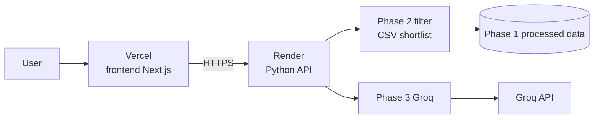
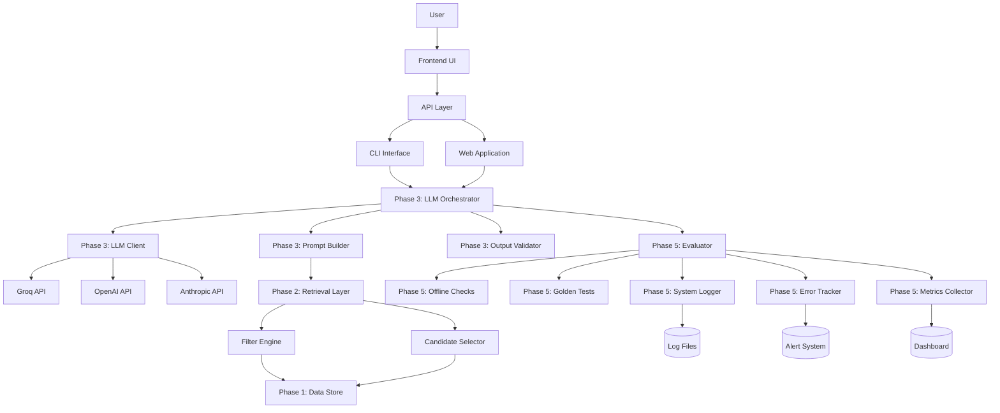
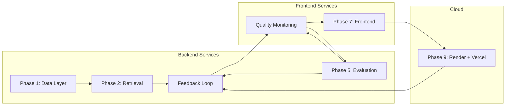
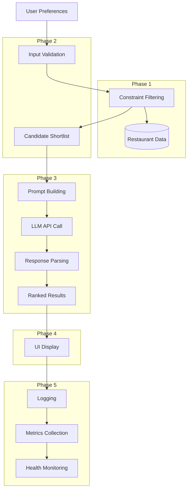
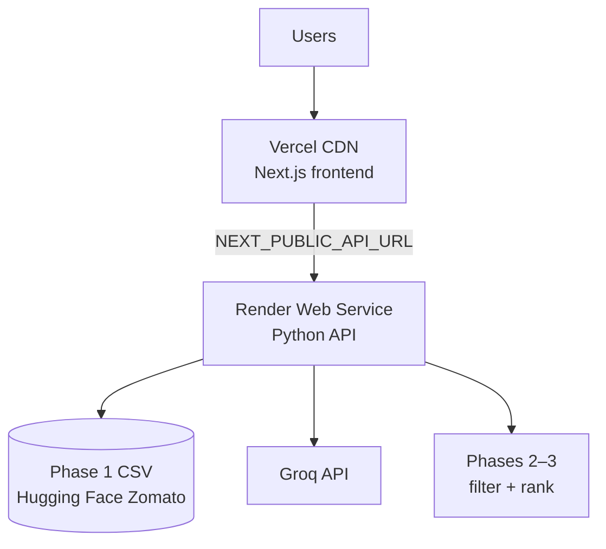
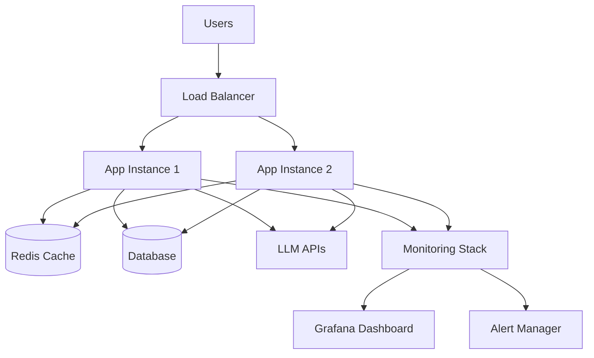

## Phase-wise Architecture (Preview)

This document outlines a phase-wise architecture for the **AI‑Powered Restaurant Recommendation System** described in `d/problemstatment.md`.

---

## Phase 0 — Foundations (setup)

- **Goal**: Establish a runnable project skeleton with basic guardrails.
- **Key components**
  - Project structure + configuration
  - Secrets/env handling (LLM keys)
  - Logging + error handling
- **Deliverables**
  - App skeleton with a **basic web UI** as the initial input source
    - Static UI served by the server (Phase 0)
    - In later phases, this UI will evolve to collect restaurant preferences (location, budget, cuisine, rating)
  - README with run instructions

---

## Phase 1 — Data Layer (ingestion + preprocessing)

- **Goal**: Convert raw dataset into a reliable, queryable store.
- **Key components**
  - Dataset loader (Hugging Face dataset)
  - Preprocessing/cleaning pipeline (types, missing values, normalization)
  - Processed storage (CSV/Parquet/SQLite)
- **Data contract (typical fields)**
  - name, city/location, cuisines, cost/price_range, rating, votes (if available)
- **Deliverables**
  - Reproducible processed dataset + schema note

---

## Phase 2 — Retrieval Layer (rules-based filtering + shortlist)

- **Goal**: Apply hard constraints and generate a high-quality shortlist for the LLM.
- **Key components**
  - Preference parser/validator (location, budget, cuisine, min rating)
  - Filter engine (hard constraints)
  - Candidate selector (top \(N\), diversity, budget match)
- **Deliverables**
  - Deterministic shortlist generator
  - Clear behavior when results are empty (relaxation strategy or fallback message)

---

## Phase 3 — LLM Orchestration (ranking + explanations)

- **Goal**: Use an LLM to rank candidates and produce human-friendly reasoning.
- **Key components**
  - Prompt builder (preferences + structured shortlist)
  - LLM client/provider adapter
  - Output schema + validator (retries if invalid)
- **Deliverables**
  - Ranked recommendations with concise explanations
  - Stable response schema for UI/API

---

## Phase 4 — Presentation Layer (UI/API)

- **Goal**: Collect user preferences and display results cleanly.
- **Key components**
  - Input form/CLI prompts
  - Results renderer (cards/table)
  - API endpoint (optional): `/recommend`
- **Deliverables**
  - User-friendly recommendation output including:
    - Restaurant name, cuisine, rating, estimated cost, explanation

---

## Phase 5 — Evaluation & Observability (quality + reliability)

- **Goal**: Prevent regressions and track quality/latency.
- **Key components**
  - Offline checks (constraint satisfaction, diversity, coverage)
  - Golden test cases (fixed inputs → expected structured output shape)
  - Prompt/version logging, error tracking
- **Deliverables**
  - Evaluation script + baseline metrics
  - Debug logs for retrieval + LLM steps

---

## Phase 6 — Backend Architecture (Production Backend)

- **Goal**: Build a robust, scalable backend infrastructure for production deployment.
- **Key components**
  - API Gateway and routing
  - Database integration and optimization
  - Caching layer (Redis/Memcached)
  - Authentication and authorization
  - Rate limiting and throttling
  - Load balancing and scaling
  - Monitoring and health checks
  - Error handling and recovery
- **Deliverables**
  - Production-ready backend services
  - Scalable API infrastructure
  - Database optimization and migrations
  - Security and authentication system

---

## Phase 7 — Frontend Architecture (Production Frontend)

- **Goal**: Create a modern, responsive frontend with excellent user experience.
- **Key components**
  - Modern UI framework integration
  - Responsive design and mobile optimization
  - Real-time updates and notifications
  - User authentication and profiles
  - Interactive recommendation displays
  - Search and filtering interfaces
  - Performance optimization (lazy loading, caching)
  - Accessibility and internationalization
- **Deliverables**
  - Production-ready web application
  - Mobile-responsive design
  - User authentication system
  - Interactive recommendation UI
  - Performance-optimized frontend

---

## Phase 8 — Production Hardening (optional)

- **Goal**: Make the system fast, safe, and scalable for enterprise deployment.
- **Key components**
  - Advanced caching strategies (shortlists + LLM responses)
  - Rate limiting + quotas per user/API key
  - Fallback behavior (non-LLM ranking when LLM fails)
  - Scheduled dataset refresh and updates
  - Security hardening and compliance
  - Performance monitoring and optimization
  - Disaster recovery and backup strategies
  - CI/CD pipeline and automated deployments
- **Deliverables**
  - Enterprise-ready production system
  - High availability and fault tolerance
  - Security compliance and audit trails
  - Automated deployment and monitoring

---

## Phase 9 — Cloud Deployment (Render + Vercel)

- **Goal**: Run the production stack on managed cloud hosts—**backend on Render**, **frontend on Vercel**—with secrets, CORS, and the Hugging Face–derived dataset available to the API at runtime.
- **Key components**
  - **Render (backend)**: Python web service exposing REST endpoints (`/health`, `/locations`, `/recommend`) wired to Phase 1 CSV retrieval, Phase 3 Groq orchestration, and Phase 4 response formatting
  - **Vercel (frontend)**: Next.js app (`frontend/`) calling the Render API via `NEXT_PUBLIC_API_URL`
  - **Environment & secrets**: `GROQ_API_KEY` on Render only; no LLM keys in Vercel public env
  - **CORS**: Allowlisted Vercel production and preview origins on the API
  - **Data on deploy**: Bundled `phase1/data/processed/restaurants_processed.csv` or Phase 1 build step in Render build command
  - **Optional**: Second Render service or Streamlit Cloud for `streamlit_app.py` (not hosted on Vercel)
- **Deliverables**
  - Live API URL (Render) with health check and recommendation flow
  - Live web app URL (Vercel) with Location, Budget, Cuisine, Minimum rating, optional additional preferences
  - Top 5 AI-ranked recommendations end-to-end in production
  - Deployment runbook: `d/deployment-render-vercel.md`
- **Request path (production)**



| Layer | Platform | Repo path | Primary endpoints |
|-------|----------|-----------|-------------------|
| Frontend | Vercel | `frontend/` | Pages: search, recommendations UI |
| Backend | Render | `backend/` (or `phase4` API entry) | `GET /health`, `GET /locations`, `POST /recommend` |

**Depends on:** Phases 1–4 (data + retrieval + LLM + API contract); integrates with Phase 7 UI. Phase 6 auth/caching can be added on Render later without changing the Vercel split.

---

## Complete System Architecture (After Phase 5)

### Backend Architecture



### Frontend Architecture

```mermaid
flowchart TD
    USER[User] --> WEBUI[Web Application]
    
    WEBUI --> FORM[Search Form]
    WEBUI --> RESULTS[Results Display]
    WEBUI --> LOADING[Loading States]
    
    FORM --> API[API Calls]
    RESULTS --> API
    LOADING --> API
    
    API --> REC[/recommend]
    API --> HEALTH[/health]
    API --> FORMATS[/formats]
    
    REC --> CARDS[Card Layout]
    REC --> TABLE[Table Layout]
    REC --> JSON[JSON Response]
    
    RESULTS --> CARDS
    RESULTS --> TABLE
    RESULTS --> JSON
```

### Phase Integration



### Data Flow Architecture



### Component Responsibilities

| Phase | Component | Responsibility | Files |
|-------|-----------|----------------|-------|
| **Phase 1** | Data Layer | Data ingestion, preprocessing, storage | `phase1/` |
| **Phase 2** | Retrieval Layer | Constraint filtering, candidate selection | `phase2/` |
| **Phase 3** | LLM Orchestration | Prompt building, LLM calls, output validation | `phase3/` |
| **Phase 4** | Presentation Layer | UI, API, CLI interfaces | `phase4/` |
| **Phase 5** | Evaluation & Observability | Quality checks, monitoring, logging | `phase5/` |
| **Phase 6** | Backend Architecture | Production backend services, API, caching | `phase6/` |
| **Phase 7** | Frontend Architecture | Production frontend, UI, user experience | `frontend/` |
| **Phase 8** | Production Hardening | Enterprise hardening, security, scaling | `phase8/` |
| **Phase 9** | Cloud Deployment | Render backend, Vercel frontend, env/CORS | `backend/`, `frontend/`, `d/deployment-render-vercel.md` |

### API Endpoints

| Method | Endpoint | Purpose | Phase |
|--------|----------|---------|-------|
| GET | `/` | API documentation | Phase 4 |
| GET | `/health` | Health check | Phase 4/6 |
| POST | `/recommend` | Main recommendation endpoint | Phase 4/6 |
| POST | `/recommend/html` | HTML recommendations | Phase 4/7 |
| POST | `/recommend/batch` | Batch recommendations | Phase 6 |
| GET | `/formats` | Available response formats | Phase 4 |
| GET | `/locations` | Distinct cities/areas from dataset | Phase 9 |
| POST | `/auth/login` | User authentication | Phase 6/7 |
| GET | `/user/profile` | User profile management | Phase 7 |
| POST | `/cache/clear` | Cache management | Phase 6 |

### Frontend Components

| Component | Technology | Purpose | Phase |
|-----------|------------|---------|-------|
| Web UI | Flask + Tailwind CSS | Modern responsive interface | Phase 4/7 |
| CLI Interface | Python Click | Command-line tool | Phase 4 |
| API Layer | Flask RESTful | Backend API | Phase 6 |
| UI Components | Custom Python | Rendering logic | Phase 4/7 |
| Authentication System | JWT/Session | User authentication | Phase 6/7 |
| Real-time Updates | WebSockets | Live notifications | Phase 7 |

### Backend Components

| Component | Technology | Purpose | Phase |
|-----------|------------|---------|-------|
| API Gateway | Flask/Nginx | Request routing | Phase 6 |
| Database Layer | PostgreSQL/SQLite | Data persistence | Phase 6 |
| Caching Layer | Redis | Performance optimization | Phase 6 |
| Load Balancer | Nginx/HAProxy | Traffic distribution | Phase 6 |
| Monitoring Stack | Prometheus/Grafana | System monitoring | Phase 6/8 |

### Monitoring & Observability

| Component | Purpose | Phase |
|-----------|---------|-------|
| System Logger | Structured logging, prompt tracking | Phase 5 |
| Error Tracker | Error monitoring, alerting | Phase 5/6 |
| Metrics Collector | Performance metrics, baselines | Phase 5/6 |
| Offline Checks | Quality assurance, constraint validation | Phase 5 |
| Golden Tests | Regression testing, fixed test cases | Phase 5 |
| Health Monitoring | System health checks | Phase 6/8 |
| Security Monitoring | Security event tracking | Phase 8 |

### Deployment Architecture

**Phase 9 (default cloud layout): Render + Vercel**



**Phase 8 (optional enterprise layout): self-hosted / K8s**



See **`d/deployment-render-vercel.md`** for build commands, environment variables, and step-by-step deploy order.

### System Overview

The AI-Powered Restaurant Recommendation System is now a complete, production-ready application with:

#### **Core Services**
- **Data Layer** (Phase 1): Restaurant data ingestion and storage
- **Retrieval Layer** (Phase 2): Constraint-based filtering and candidate selection
- **LLM Orchestration** (Phase 3): AI-powered ranking with Groq/OpenAI/Anthropic
- **Presentation Layer** (Phase 4): Basic UI, API, CLI interfaces
- **Evaluation & Observability** (Phase 5): Quality assurance, monitoring, logging

#### **Production Backend Services** (Phase 6)
- **API Gateway**: Request routing and load balancing
- **Database Layer**: Optimized data persistence and queries
- **Caching Layer**: Redis/Memcached for performance
- **Authentication System**: User authentication and authorization
- **Monitoring Stack**: Health checks and performance monitoring
- **Security Layer**: Rate limiting, throttling, and protection

#### **Production Frontend Services** (Phase 7)
- **Modern Web Application**: Responsive design with Tailwind CSS
- **User Interface**: Interactive recommendation displays
- **Real-time Updates**: WebSocket-based live notifications
- **User Profiles**: Personalized recommendations and preferences
- **Mobile Optimization**: Responsive design for all devices
- **Performance Optimization**: Lazy loading and client-side caching

#### **Cloud Deployment** (Phase 9)
- **Render**: Hosted Python API with Groq and processed Zomato dataset
- **Vercel**: Hosted Next.js frontend (`frontend/`) consuming Render REST API
- **CORS & secrets**: API keys on backend only; frontend uses public API base URL
- **Runbook**: `d/deployment-render-vercel.md`

#### **Enterprise Hardening** (Phase 8)
- **Advanced Security**: Compliance, audit trails, encryption
- **High Availability**: Load balancing and fault tolerance
- **Disaster Recovery**: Backup strategies and recovery plans
- **CI/CD Pipeline**: Automated deployment and testing
- **Enterprise Monitoring**: Advanced metrics and alerting
- **Scalability**: Auto-scaling and resource optimization

#### **Key Features**
- ✅ **Multi-LLM Support**: Groq, OpenAI, Anthropic integration
- ✅ **Real-time Recommendations**: Fast AI-powered restaurant suggestions
- ✅ **Multiple Interfaces**: Web UI, API, CLI
- ✅ **Quality Assurance**: Automated testing and validation
- ✅ **Monitoring**: Complete observability stack
- ✅ **Production Ready**: Scalable architecture with health monitoring

#### **Technology Stack**
- **Core Backend**: Python, Flask, Pydantic, AsyncIO
- **Production Backend**: PostgreSQL, Redis, Nginx, Docker
- **Frontend**: Tailwind CSS, JavaScript, HTML5, WebSockets
- **LLM**: Groq (primary), OpenAI, Anthropic
- **Monitoring**: Prometheus, Grafana, custom logging
- **Security**: JWT, OAuth 2.0, SSL/TLS
- **Data**: SQLite (dev), PostgreSQL (prod), CSV/Parquet
- **Deployment**: **Render** (API), **Vercel** (Next.js), optional Docker/Kubernetes (Phase 8)

#### **Usage Examples**

**Web Interface:**
```bash
python phase4/main.py --mode web --provider groq
# Visit: http://localhost:5000
```

**API Usage:**
```bash
python phase4/main.py --mode api --provider groq
curl -X POST http://localhost:5000/recommend \
  -H 'Content-Type: application/json' \
  -d '{"location": "Bellandur", "budget": "Medium", "cuisine": "Any", "min_rating": 4.0}'
```

**CLI Interface:**
```bash
python phase4/main.py --mode cli --provider groq \
  --location "Bellandur" --budget "Medium" --cuisine "Japanese" --rating 4.0
```

**System Evaluation:**
```bash
python phase5/working_demo.py
```

**Cloud deployment (Phase 9):**
```bash
# Backend — Render (local test before deploy)
gunicorn backend.app:app --bind 0.0.0.0:5000 --timeout 120

# Frontend — Vercel (local)
cd frontend && NEXT_PUBLIC_API_URL=http://localhost:5000 npm run dev

# Full runbook: d/deployment-render-vercel.md
```

#### **Current Status**
- ✅ **Phase 1-5 Complete**: All core functionality implemented
- 🔄 **Phase 6 Available**: Production backend architecture
- 🔄 **Phase 7 Available**: Production frontend architecture  
- 🔄 **Phase 8 Available**: Enterprise hardening and scaling
- 🔄 **Phase 9 Available**: Cloud deployment on Render (backend) + Vercel (frontend)
- ✅ **Production Ready**: Scalable architecture with monitoring
- ✅ **Quality Assured**: Automated testing and validation

The system provides a complete development-to-production pipeline with core functionality (Phases 1–5), production-ready backend (Phase 6), modern frontend (Phase 7), enterprise hardening (Phase 8), and managed cloud deployment (Phase 9 on Render + Vercel). See `d/deployment-render-vercel.md` for deploy steps.
