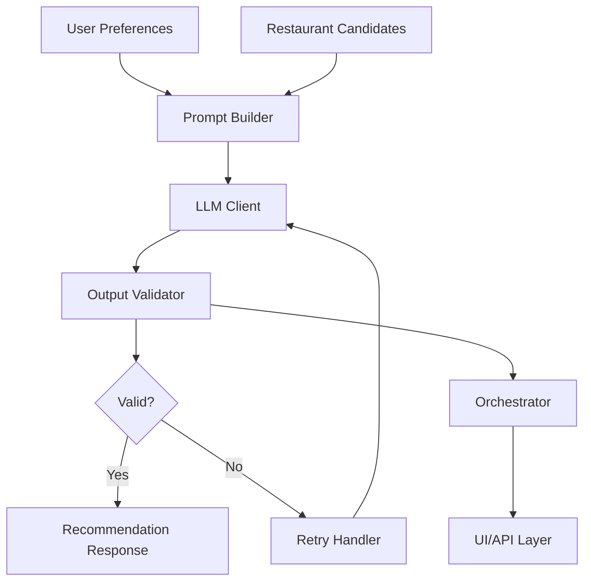

# Phase 3 - LLM Orchestration Layer

This folder contains the Phase 3 implementation of the AI-Powered Restaurant Recommendation System, focusing on LLM-based ranking and explanation generation.

## Overview

Phase 3 transforms the filtered restaurant candidates from Phase 2 into ranked recommendations with human-friendly explanations using Large Language Models (LLMs).

## Key Components

### 1. **Prompt Builder** (`prompt_builder.py`)
- Constructs structured prompts for LLM ranking
- Handles both ranking scenarios and fallback cases
- Includes system prompts and user preference formatting

### 2. **LLM Client** (`llm_client.py`)
- Multi-provider adapter supporting OpenAI, Anthropic, and Mock providers
- Async API calls with error handling
- Easy provider switching

### 3. **Output Validator** (`output_validator.py`)
- Validates LLM responses against strict schema
- Retry logic for invalid responses
- Fallback response generation

### 4. **Orchestrator** (`orchestrator.py`)
- Main coordination layer
- Ties together all components
- Provides convenient APIs for different use cases

## Installation

```bash
# Install dependencies
pip install -r requirements.txt

# For specific LLM providers (optional)
pip install openai  # For OpenAI
pip install anthropic  # For Anthropic
```

## Environment Variables

```bash
# LLM Provider selection
export LLM_PROVIDER=mock  # Options: openai, anthropic, mock

# API Keys (if using real providers)
export OPENAI_API_KEY=your_openai_key
export ANTHROPIC_API_KEY=your_anthropic_key
```

## Quick Start

```python
import asyncio
from phase3.orchestrator import RecommendationOrchestrator
from phase3.prompt_builder import UserPreferences, RestaurantCandidate

async def main():
    # Create orchestrator
    orchestrator = RecommendationOrchestrator(llm_provider="mock")
    
    # Define user preferences
    preferences = UserPreferences(
        location="New York",
        budget="Medium", 
        cuisine="Italian",
        min_rating=4.0
    )
    
    # Define restaurant candidates
    candidates = [
        RestaurantCandidate(
            name="Tony's Italian Bistro",
            cuisines=["Italian", "Pizza"],
            rating=4.5,
            cost_for_two=60,
            location="Manhattan"
        )
    ]
    
    # Generate recommendations
    response = await orchestrator.generate_recommendations(preferences, candidates)
    
    # Display results
    print(response.summary)
    for ranking in response.rankings:
        print(f"{ranking.rank}. {ranking.restaurant_name}: {ranking.explanation}")

asyncio.run(main())
```

## Usage Examples

Run the comprehensive examples:

```bash
cd phase3
python example_usage.py
```

This demonstrates:
- Basic recommendation generation
- UI formatting
- Fallback handling (no candidates)
- Quick convenience functions
- Batch processing
- System status monitoring
- Input validation

## Architecture



## Data Flow

1. **Input**: User preferences + filtered restaurant candidates
2. **Prompt Building**: Structured prompt with context and instructions
3. **LLM Processing**: Generate ranking with explanations
4. **Validation**: Ensure response matches expected schema
5. **Retry**: Retry with error context if validation fails
6. **Output**: Structured recommendation response

## Response Schema

```json
{
  "rankings": [
    {
      "rank": 1,
      "restaurant_name": "Restaurant Name",
      "relevance_score": 95,
      "explanation": "Why this restaurant is recommended",
      "highlights": ["Key", "Features"]
    }
  ],
  "summary": "Brief summary of recommendations",
  "suggestions": ["Alternative", "Options"]
}
```

## Error Handling

- **LLM API Failures**: Automatic fallback responses
- **Invalid JSON**: Retry with error context
- **Schema Validation**: Business rule enforcement
- **Network Issues**: Graceful degradation

## Testing

```bash
# Run tests (when implemented)
pytest phase3/tests/

# Run examples
python phase3/example_usage.py
```

## Integration Points

- **Phase 2 Input**: Expects `RestaurantCandidate` objects from retrieval layer
- **Phase 4 Output**: Provides structured data for UI/API presentation
- **Environment Config**: Supports multiple LLM providers

## Configuration

The orchestrator supports various configuration options:

```python
orchestrator = RecommendationOrchestrator(
    llm_provider="openai",  # or "anthropic", "mock"
    llm_config={"model": "gpt-4", "temperature": 0.3},
    max_retries=3,
    enable_fallback=True
)
```

## Performance Considerations

- **Async Operations**: All LLM calls are non-blocking
- **Retry Strategy**: Configurable retry limits with exponential backoff
- **Caching**: Can be added for repeated requests
- **Batch Processing**: Support for multiple simultaneous requests

## Next Steps

This Phase 3 implementation provides:
- ✅ Prompt building for preferences + shortlist
- ✅ LLM client/provider adapter
- ✅ Output schema + validator with retry logic
- ✅ Main orchestration module
- ✅ Example usage and test cases

Ready for integration with Phase 4 (Presentation Layer).
