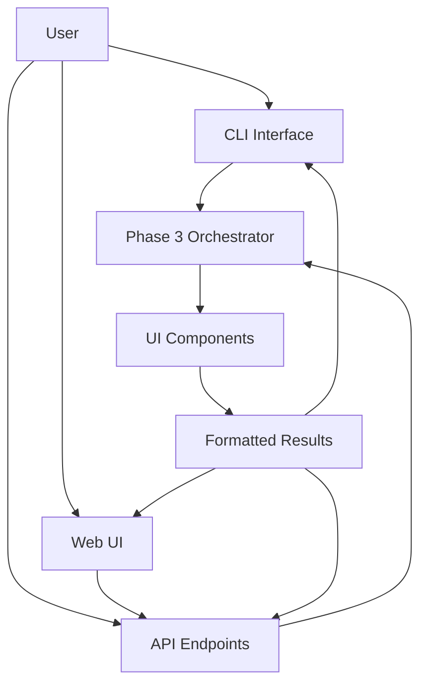

# Phase 4 - Presentation Layer (UI/API)

This folder contains the Phase 4 implementation of the AI-Powered Restaurant Recommendation System, focusing on user interfaces and API endpoints for collecting preferences and displaying results.

## Overview

Phase 4 provides the user-facing layer that interacts with Phase 3's LLM orchestration to collect user preferences and display restaurant recommendations in various formats.

## Key Components

### 1. **CLI Interface** (`cli_interface.py`)
- Interactive command-line interface for user preferences
- Supports both interactive and argument-based usage
- Formatted output with emoji indicators
- Input validation and error handling

### 2. **UI Components** (`ui_components.py`)
- Multiple rendering formats (cards, tables, compact, detailed)
- HTML generation with CSS styling
- JSON API response formatting
- Configurable themes and display options

### 3. **API Endpoints** (`api_endpoints.py`)
- RESTful API with `/recommend` endpoint
- Support for JSON and HTML responses
- Batch processing capabilities
- Health check and documentation endpoints

### 4. **Web Application** (`web_app.py`)
- Modern responsive web UI using Tailwind CSS
- Interactive search form with real-time validation
- Card-based recommendation display
- Loading states and error handling

### 5. **Main Integration** (`main.py`)
- Unified entry point for all modes
- System status monitoring
- Configuration management
- Mode selection (CLI, API, Web)

### 6. **Streamlit (basic UI)** — repo root `streamlit_app.py`

```bash
pip install -r streamlit-requirements.txt
streamlit run streamlit_app.py
```

Uses `phase4/csv_candidates.py` for retrieval from `phase1/data/processed/restaurants_processed.csv` and optional Groq ranking (Phase 3).

## Installation

```bash
# Install dependencies
pip install -r requirements.txt

# For Groq provider (recommended)
pip install groq
export GROQ_API_KEY=your_groq_key

# For other providers (optional)
pip install openai  # For OpenAI
pip install anthropic  # For Anthropic
```

## Environment Variables

```bash
# LLM Provider selection
export LLM_PROVIDER=groq  # Options: groq, openai, anthropic, mock

# API Keys
export GROQ_API_KEY=your_groq_key
export OPENAI_API_KEY=your_openai_key  # Optional
export ANTHROPIC_API_KEY=your_anthropic_key  # Optional
```

## Quick Start

### 1. Web Application (Recommended)

```bash
# Start web server
python phase4/main.py --mode web --provider groq

# Visit http://localhost:5000
```

### 2. CLI Interface

```bash
# Interactive mode
python phase4/main.py --mode cli --provider groq

# With arguments
python phase4/main.py --mode cli --provider groq \
  --location "San Francisco" \
  --budget "Medium" \
  --cuisine "Japanese" \
  --rating 4.0
```

### 3. API Server

```bash
# Start API server
python phase4/main.py --mode api --provider groq --port 5000

# Test endpoints
curl http://localhost:5000/health
curl -X POST http://localhost:5000/recommend \
  -H 'Content-Type: application/json' \
  -d '{"location": "San Francisco", "budget": "Medium", "cuisine": "Japanese", "min_rating": 4.0}'
```

## API Endpoints

### Main Recommendation Endpoint

**POST** `/recommend`

```json
{
  "location": "San Francisco",
  "budget": "Medium",
  "cuisine": "Japanese", 
  "min_rating": 4.0
}
```

**Response:**
```json
{
  "success": true,
  "data": {
    "summary": "Found 2 restaurants matching your criteria",
    "total_results": 2,
    "rankings": [
      {
        "rank": 1,
        "restaurant_name": "Sushi Paradise",
        "relevance_score": 92,
        "explanation": "Excellent Japanese restaurant with high ratings",
        "highlights": ["Fresh sushi", "Great service", "Reasonable prices"]
      }
    ],
    "suggestions": ["Try nearby locations", "Consider different cuisine"]
  }
}
```

### Additional Endpoints

- **GET** `/health` - Health check
- **GET** `/formats` - Available response formats
- **POST** `/recommend/html` - HTML recommendations
- **POST** `/recommend/batch` - Batch processing

## Usage Examples

Run comprehensive examples:

```bash
cd phase4
python example_usage.py
```

This demonstrates:
- CLI interface functionality
- UI component rendering
- API endpoint usage
- Web application features
- Full integration testing

## Architecture



## Features

### 🖥️ CLI Interface
- Interactive preference collection
- Formatted output with emojis
- Argument-based usage
- Input validation

### 🌐 Web Application
- Modern responsive design
- Real-time form validation
- Card-based results display
- Loading states and error handling

### 🔌 API Endpoints
- RESTful design
- Multiple response formats
- Batch processing
- Health monitoring

### 🎨 UI Components
- Multiple rendering formats
- HTML generation with CSS
- Configurable themes
- Mobile-friendly layouts

## Configuration

### CLI Configuration

```python
config = CLIConfig(
    llm_provider="groq",
    max_candidates=10,
    show_debug=False
)
```

### API Configuration

```python
config = APIConfig(
    host="0.0.0.0",
    port=5000,
    debug=False,
    llm_provider="groq",
    enable_cors=True
)
```

### UI Rendering Configuration

```python
config = RenderConfig(
    theme="modern",
    show_scores=True,
    show_highlights=True,
    max_items_per_page=10
)
```

## Response Formats

The system supports multiple output formats:

### Card Layout
- Visual card-based display
- Relevance scores with colors
- Highlight tags

### Table Layout
- Structured tabular format
- Sortable columns
- Compact display

### Compact Format
- Minimal text output
- Quick overview
- CLI-friendly

### Detailed Format
- Full metadata
- Score categories
- Extended information

### JSON API Format
- Structured API response
- Machine-readable
- Developer-friendly

## Error Handling

- **Input Validation**: Comprehensive validation of user preferences
- **API Errors**: Proper HTTP status codes and error messages
- **Fallback Responses**: Graceful degradation when LLM fails
- **Network Issues**: Timeout and retry handling

## Performance Considerations

- **Async Operations**: Non-blocking LLM calls
- **Caching**: Can be added for repeated requests
- **Rate Limiting**: Configurable API rate limits
- **Batch Processing**: Efficient handling of multiple requests

## Development

### Running Tests

```bash
# Run all examples
python phase4/example_usage.py

# Test specific components
python -m pytest phase4/tests/

# Check system status
python phase4/main.py --status
```

### Adding New Features

1. **New UI Components**: Extend `UIComponents` class
2. **New API Endpoints**: Add routes in `APIEndpoints`
3. **New CLI Commands**: Extend `CLIInterface`
4. **Web UI Features**: Update HTML template in `web_app.py`

## Integration with Phase 3

Phase 4 seamlessly integrates with Phase 3 components:

- **Orchestrator**: Uses `RecommendationOrchestrator` for LLM operations
- **Data Models**: Reuses `UserPreferences` and `RestaurantCandidate`
- **Response Schema**: Validates against `RecommendationResponse`

## Production Deployment

### Docker Deployment

```dockerfile
FROM python:3.9-slim
WORKDIR /app
COPY requirements.txt .
RUN pip install -r requirements.txt
COPY . .
EXPOSE 5000
CMD ["python", "phase4/main.py", "--mode", "web", "--provider", "groq"]
```

### Environment Setup

```bash
# Production environment
export FLASK_ENV=production
export LLM_PROVIDER=groq
export GROQ_API_KEY=your_production_key
export SECRET_KEY=your_secret_key
```

## Next Steps

This Phase 4 implementation provides:
- ✅ Input form/CLI prompts for user preferences
- ✅ Results renderer (cards/table display)
- ✅ API endpoint `/recommend`
- ✅ User-friendly recommendation output
- ✅ Modern web UI with responsive design
- ✅ Groq LLM provider integration
- ✅ Complete examples and documentation

Ready for Phase 5 (Evaluation & Observability) or production deployment.
