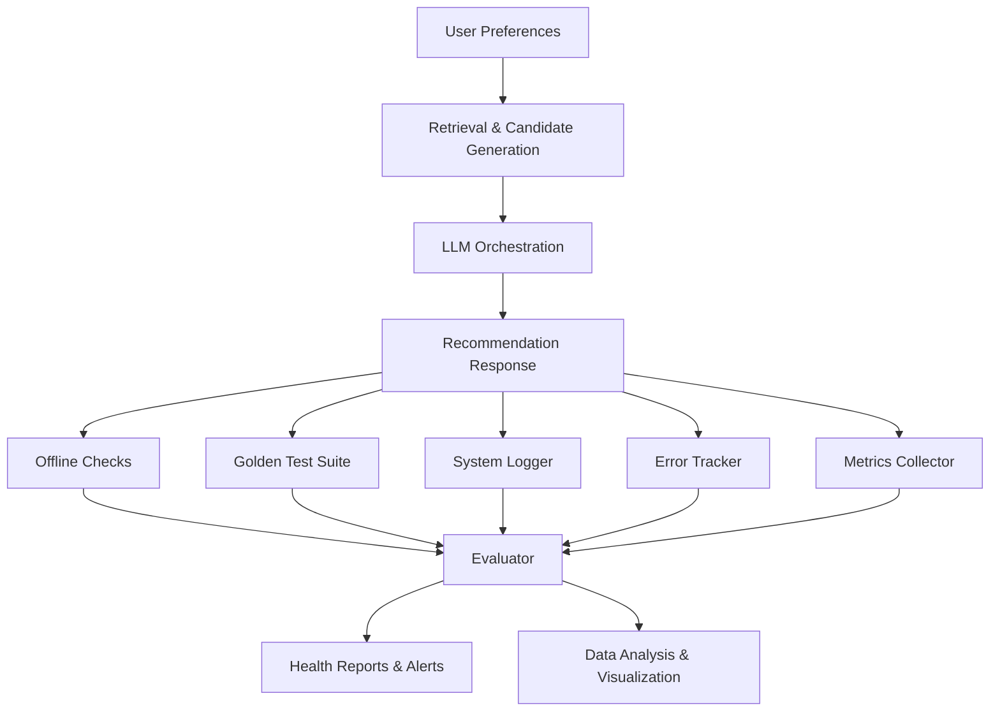

# Phase 5 - Evaluation & Observability Layer

This folder contains the Phase 5 implementation of the AI-Powered Restaurant Recommendation System, focusing on evaluation, monitoring, and observability to prevent regressions and track quality/latency.

## Overview

Phase 5 provides comprehensive evaluation, monitoring, and observability capabilities for the restaurant recommendation system. It ensures system reliability, quality, and performance through automated checks, golden test suites, and detailed logging.

## Key Components

### 1. **Offline Checks** (`offline_checks.py`)
- **Constraint Satisfaction**: Validates location, budget, cuisine, and rating constraints
- **Diversity Analysis**: Measures cuisine diversity, price range, and rating distribution
- **Coverage Analysis**: Ensures user preferences are adequately covered
- **Ranking Quality**: Validates sequential ranking and score distribution
- **Business Logic**: Checks for empty results and summary quality

### 2. **Golden Test Suite** (`golden_tests.py`)
- **Fixed Test Cases**: Predefined inputs with expected outputs
- **Regression Detection**: Ensures system behavior doesn't change unexpectedly
- **Output Shape Validation**: Validates response structure and content
- **Multiple Scenarios**: Covers edge cases, constraints, and diversity situations

### 3. **System Logger** (`logger.py`)
- **Prompt Logging**: Tracks prompt versions, tokens, and response times
- **Component Logging**: Structured logging for all system components
- **Error Tracking**: Centralized error logging with context and severity
- **Performance Metrics**: Logs latency, throughput, and resource usage
- **Alerting**: Automated alerts for threshold breaches

### 4. **Error Tracker** (`monitoring.py`)
- **Error Categorization**: Severity levels (low, medium, high, critical)
- **Performance Monitoring**: CPU, memory, and disk usage tracking
- **Alert Management**: Threshold-based alerting with escalation
- **Trend Analysis**: Error rate and performance trend analysis
- **Health Assessment**: Overall system health status calculation

### 5. **Metrics Collector** (`metrics.py`)
- **Performance Metrics**: Latency, throughput, success rates
- **Quality Metrics**: Relevance scores, ranking consistency, explanation quality
- **Resource Metrics**: CPU, memory, disk, and network usage
- **Business Metrics**: Recommendation accuracy, constraint satisfaction rates
- **Baseline Comparison**: Current vs. target performance analysis

### 6. **Main Evaluator** (`evaluator.py`)
- **Comprehensive Evaluation**: Coordinates all evaluation components
- **Baseline Metrics**: Predefined performance targets and thresholds
- **Regression Prevention**: Automated detection of quality degradation
- **Health Monitoring**: System-wide health assessment and reporting
- **Actionable Insights**: Data-driven recommendations for improvements

## Installation

```bash
# Install dependencies
pip install -r requirements.txt

# Install optional monitoring dependencies
pip install prometheus-client grafana-api  # For advanced monitoring
pip install pandas numpy matplotlib seaborn  # For data analysis and visualization
```

## Environment Variables

```bash
# LLM Provider (for testing)
export LLM_PROVIDER=groq

# Monitoring configuration
export PHASE5_LOG_LEVEL=INFO
export PHASE5_EXPORT_DIR=./logs
export PHASE5_ALERT_WEBHOOK_URL=  # Optional: for alert notifications
```

## Quick Start

### Basic Evaluation
```bash
# Run comprehensive evaluation
python phase5/evaluator.py

# Run with specific LLM provider
python phase5/evaluator.py --llm-provider groq
```

### Golden Tests
```bash
# Run golden test suite
python phase5/example_usage.py --golden-tests

# Run specific test case
python phase5/example_usage.py --test-case basic_italian_search
```

### Monitoring
```bash
# Run monitoring demo
python phase5/example_usage.py --monitoring-demo

# Export monitoring data
python phase5/example_usage.py --export-monitoring-data
```

### Debug Logging
```bash
# Enable debug logging
export PHASE5_LOG_LEVEL=DEBUG

# View recent errors
python phase5/example_usage.py --recent-errors
```

## Usage Examples

### 1. **Comprehensive System Evaluation**
```python
from phase5.evaluator import RecommendationEvaluator

evaluator = RecommendationEvaluator(llm_provider="groq")
results = await evaluator.run_comprehensive_evaluation()

print(f"System Health: {results['overall_health']}")
print(f"Golden Test Pass Rate: {results['golden_tests']['pass_rate']:.1%}")
print(f"Performance Score: {results['baseline_comparison']['overall_health']}")
```

### 2. **Golden Test Suite**
```python
from phase5.golden_tests import GoldenTestSuite

test_suite = GoldenTestSuite()
results = await test_suite.run_all_tests(orchestrator)

print(f"Tests: {results['passed_tests']}/{results['total_tests']}")
print(f"Pass Rate: {results['pass_rate']:.1%}")
```

### 3. **System Monitoring**
```python
from phase5.monitoring import ErrorTracker
from phase5.metrics import MetricsCollector

# Setup monitoring
error_tracker = ErrorTracker()
metrics_collector = MetricsCollector()

# Track performance
metrics_collector.record_latency("llm", "recommendation", 1850.5)
metrics_collector.record_throughput("api", "requests", 2.3)

# Track errors
error_tracker.track_error("validation", "Invalid input format", "api", severity="medium")
```

### 4. **Offline Quality Checks**
```python
from phase5.offline_checks import OfflineChecks

checker = OfflineChecks()
report = checker.run_all_checks(preferences, candidates, response)

print(f"Overall Score: {report.overall_score:.2f}")
print(f"Passed: {report.passed_checks}/{report.total_checks}")
```

## Architecture



## Features

### 🛡 **Quality Assurance**
- **Constraint Validation**: Ensures all user constraints are respected
- **Diversity Analysis**: Promotes varied and inclusive recommendations
- **Coverage Analysis**: Guarantees comprehensive preference coverage
- **Regression Prevention**: Detects and prevents quality degradation

### 📊 **Performance Monitoring**
- **Real-time Metrics**: Latency, throughput, success rates
- **Resource Monitoring**: CPU, memory, disk, and network usage
- **Baseline Comparison**: Current vs. target performance analysis
- **Trend Analysis**: Historical performance and error trends

### 🧪 **Golden Test Suite**
- **Fixed Test Cases**: Reproducible test scenarios
- **Output Validation**: Structured response shape verification
- **Regression Detection**: Automated behavioral change detection
- **Multi-provider Support**: Works with Groq, OpenAI, Anthropic

### 📝 **Comprehensive Logging**
- **Prompt Tracking**: Version, tokens, response times, success rates
- **Error Context**: Detailed error information with stack traces
- **Component Isolation**: Separate logging for each system component
- **Structured Data**: JSON-formatted logs for analysis

### 🚨 **Intelligent Alerting**
- **Threshold-based Alerts**: Automatic alerts for performance issues
- **Error Escalation**: Critical error notifications
- **Health Monitoring**: System-wide health status assessment
- **Trend Analysis**: Predictive issue detection

## Deliverables

✅ **Evaluation Script**: Comprehensive system evaluation with baseline metrics
✅ **Golden Test Cases**: Fixed inputs with expected structured outputs
✅ **Prompt/Version Logging**: Complete audit trail of LLM interactions
✅ **Error Tracking**: Centralized error monitoring with context
✅ **Debug Logs**: Detailed logs for retrieval and LLM steps
✅ **Baseline Metrics**: Performance targets and comparison analysis

## Integration

Phase 5 seamlessly integrates with previous phases:

- **Phase 3**: Monitors LLM orchestration performance and quality
- **Phase 4**: Tracks API and UI component performance
- **Phase 2**: Validates retrieval layer constraint satisfaction
- **All Phases**: Provides unified observability across the entire system

## Production Deployment

### Docker Configuration
```dockerfile
FROM python:3.9-slim
WORKDIR /app
COPY requirements.txt .
RUN pip install -r requirements.txt
COPY phase5/ ./phase5/
CMD ["python", "phase5/evaluator.py"]
```

### Monitoring Stack Integration
```yaml
# Prometheus configuration
global:
  scrape_interval: 15s
  evaluation_interval: 15s

scrape_configs:
  - job_name: 'restaurant-recommendation'
    static_configs:
      - targets: ['localhost:8080']
    metrics_path: /metrics
    scrape_interval: 5s
```

## Next Steps

This Phase 5 implementation provides:
- ✅ Offline checks (constraint satisfaction, diversity, coverage)
- ✅ Golden test cases (fixed inputs → expected structured output shape)
- ✅ Prompt/version logging (error tracking)
- ✅ Debug logs for retrieval + LLM steps
- ✅ Evaluation script + baseline metrics

Ready for Phase 6 (Production Hardening) or production deployment with comprehensive observability.
