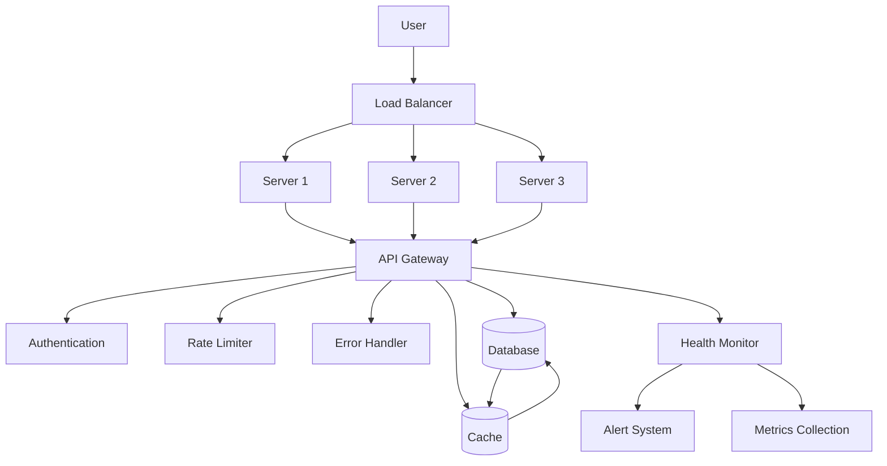

# Phase 6 - Production Backend Architecture

This folder contains the Phase 6 implementation of the AI-Powered Restaurant Recommendation System, focusing on production-ready backend infrastructure with comprehensive monitoring, caching, authentication, and scalability.

## Overview

Phase 6 provides enterprise-grade backend infrastructure for the restaurant recommendation system, including API Gateway, database optimization, caching layers, authentication, rate limiting, load balancing, monitoring, and error handling.

## Key Components

### 1. **API Gateway** (`api_gateway.py`)
- **Centralized Request Routing**: Unified entry point for all API requests
- **Middleware Management**: Request logging, CORS, authentication
- **Route Registration**: Dynamic route registration with metadata
- **Flask Integration**: Compatibility with existing Phase 4 Flask app
- **Request Context**: Comprehensive request tracking and metadata

### 2. **Database Manager** (`database.py`)
- **Multi-Database Support**: SQLite for development, PostgreSQL for production
- **Connection Pooling**: Optimized database connections with pooling
- **Query Optimization**: Performance tracking and optimization
- **Migration Support**: Database schema management
- **Caching Integration**: Database-level caching for performance

### 3. **Cache Manager** (`cache.py`)
- **Multi-Backend Support**: Redis, Memcached, and in-memory caching
- **Cache Warming**: Preloading frequently accessed data
- **Intelligent Invalidation**: Pattern-based cache invalidation
- **Performance Monitoring**: Cache hit rates and performance metrics
- **Serialization Options**: JSON and pickle serialization support

### 4. **Authentication Manager** (`auth.py`)
- **JWT-Based Authentication**: Secure token-based authentication
- **Role-Based Access Control**: Granular permissions and roles
- **User Management**: Complete user lifecycle management
- **Security Features**: Rate limiting, account lockout, session management
- **Password Security**: bcrypt hashing with salt

### 5. **Rate Limiter** (`rate_limiter.py`)
- **Multiple Algorithms**: Token bucket, sliding window, fixed window, leaky bucket
- **Distributed Support**: Redis-based distributed rate limiting
- **Flexible Configuration**: Per-endpoint and per-user rate limiting
- **Performance Metrics**: Comprehensive rate limiting statistics
- **Middleware Integration**: Easy integration with API Gateway

### 6. **Load Balancer** (`load_balancer.py`)
- **Multiple Algorithms**: Round robin, least connections, weighted, IP hash
- **Health Checking**: Automatic server health monitoring
- **Auto-Scaling**: Dynamic server scaling based on load
- **Sticky Sessions**: Session affinity support
- **Traffic Distribution**: Intelligent traffic routing

### 7. **Health Monitor** (`monitoring.py`)
- **Comprehensive Health Checks**: System, database, cache, API monitoring
- **Alert System**: Configurable alerts with multiple severity levels
- **Metrics Collection**: Performance and resource metrics
- **Dashboard Integration**: Ready for Grafana/Prometheus integration
- **Historical Data**: Metrics history and trend analysis

### 8. **Error Handler** (`error_handler.py`)
- **Error Classification**: Intelligent error categorization
- **Recovery Strategies**: Automated error recovery actions
- **Circuit Breakers**: Fault tolerance with circuit breaking
- **Retry Policies**: Configurable retry with exponential backoff
- **Error Analytics**: Comprehensive error tracking and analysis

## Installation

```bash
# Install dependencies
pip install -r requirements.txt

# Install optional dependencies for production
pip install redis-server memcached  # For caching servers
pip install prometheus-client grafana-api  # For monitoring
```

## Environment Variables

```bash
# Database Configuration
export DB_TYPE=postgresql  # sqlite or postgresql
export DB_HOST=localhost
export DB_PORT=5432
export DB_NAME=restaurant_recommendations
export DB_USERNAME=postgres
export DB_PASSWORD=your_password

# Cache Configuration
export CACHE_BACKEND=redis  # redis, memcached, or memory
export CACHE_HOST=localhost
export CACHE_PORT=6379
export CACHE_PASSWORD=your_cache_password

# Authentication
export JWT_SECRET=your-super-secret-jwt-key-change-in-production
export JWT_EXPIRATION_HOURS=24

# Rate Limiting
export RATE_LIMIT_DISTRIBUTED=true
export RATE_LIMIT_GLOBAL_REQUESTS=1000
export RATE_LIMIT_GLOBAL_WINDOW=60

# Monitoring
export MONITORING_ENABLED=true
export HEALTH_CHECK_INTERVAL=30

# Load Balancing
export LOAD_BALANCER_ALGORITHM=health_aware
export AUTO_SCALING_ENABLED=true
```

## Quick Start

### Basic Backend Setup
```python
from phase6 import APIGateway, DatabaseManager, CacheManager, AuthManager

# Initialize components
gateway = APIGateway()
db_manager = DatabaseManager()
cache_manager = CacheManager()
auth_manager = AuthManager()

# Start the backend
app = gateway.create_flask_app()
app.run(host='0.0.0.0', port=5000)
```

### Complete Production Setup
```python
import asyncio
from phase6 import *

async def setup_production_backend():
    # Initialize all components
    gateway = APIGateway()
    db_manager = DatabaseManager()
    cache_manager = CacheManager()
    auth_manager = AuthManager()
    rate_limiter = RateLimiter(cache_manager)
    load_balancer = LoadBalancer()
    health_monitor = HealthMonitor()
    error_handler = ErrorHandler()
    
    # Configure integrations
    cache_manager.set_database_manager(db_manager)
    health_monitor.set_cache_manager(cache_manager)
    error_handler.set_health_monitor(health_monitor)
    
    # Setup circuit breakers
    error_handler.create_circuit_breaker(
        "database",
        CircuitBreakerConfig(failure_threshold=5, recovery_timeout=60)
    )
    
    # Setup retry policies
    error_handler.create_retry_policy(
        "api_calls",
        max_attempts=3,
        base_delay=1.0
    )
    
    # Add servers to load balancer
    load_balancer.add_server("server1", "192.168.1.10", 8080)
    load_balancer.add_server("server2", "192.168.1.11", 8080)
    load_balancer.add_server("server3", "192.168.1.12", 8080)
    
    print("Production backend setup complete!")
    return {
        'gateway': gateway,
        'db_manager': db_manager,
        'cache_manager': cache_manager,
        'auth_manager': auth_manager,
        'rate_limiter': rate_limiter,
        'load_balancer': load_balancer,
        'health_monitor': health_monitor,
        'error_handler': error_handler
    }

# Run setup
components = asyncio.run(setup_production_backend())
```

## Usage Examples

### API Gateway Usage
```python
from phase6.api_gateway import APIGateway

gateway = APIGateway()

# Handle requests
response = await gateway.handle_request(
    method='POST',
    path='/recommend',
    body={
        'location': 'New York',
        'budget': 'Medium',
        'cuisine': 'Italian'
    }
)

print(f"Response: {response}")
```

### Database Operations
```python
from phase6.database import DatabaseManager, DatabaseConfig

# Initialize database
config = DatabaseConfig(db_type="postgresql", host="localhost", database="restaurant_db")
db_manager = DatabaseManager(config)

# Search restaurants
restaurants = db_manager.search_restaurants(
    location="New York",
    cuisine="Italian",
    min_rating=4.0,
    limit=10
)

print(f"Found {len(restaurants)} restaurants")
```

### Caching Usage
```python
from phase6.cache import CacheManager, CacheConfig

# Initialize cache
config = CacheConfig(backend="redis", host="localhost", port=6379)
cache_manager = CacheManager(config)

# Cache recommendations
await cache_manager.set(
    "recommendations:user123:italian",
    recommendation_data,
    ttl=300  # 5 minutes
)

# Get cached recommendations
cached_data = await cache_manager.get("recommendations:user123:italian")
```

### Authentication Usage
```python
from phase6.auth import AuthManager, AuthConfig

auth_manager = AuthManager(AuthConfig())

# Create user
user = await auth_manager.create_user(
    username="john_doe",
    password="secure_password123",
    email="john@example.com",
    role=UserRole.USER
)

# Authenticate
token = await auth_manager.authenticate_user(
    username="john_doe",
    password="secure_password123",
    ip_address="192.168.1.100"
)

print(f"Access token: {token.access_token}")
```

### Rate Limiting Usage
```python
from phase6.rate_limiter import RateLimiter, RateLimitConfig

rate_limiter = RateLimiter()

# Check rate limit
result = await rate_limiter.check_user_limit("user123")

if result.allowed:
    print("Request allowed")
    print(f"Remaining requests: {result.remaining_requests}")
else:
    print(f"Rate limited. Retry after {result.retry_after} seconds")
```

### Load Balancing Usage
```python
from phase6.load_balancer import LoadBalancer, LoadBalancerConfig

load_balancer = LoadBalancer(LoadBalancerConfig())

# Add servers
load_balancer.add_server("server1", "192.168.1.10", 8080, weight=2)
load_balancer.add_server("server2", "192.168.1.11", 8080, weight=1)

# Route request
result = await load_balancer.route_request(
    {"action": "get_recommendations", "location": "NYC"},
    session_id="user_session_123",
    client_ip="192.168.1.100"
)

print(f"Request routed to: {result['server_address']}")
```

### Health Monitoring Usage
```python
from phase6.monitoring import HealthMonitor

health_monitor = HealthMonitor("production_backend")

# Get overall health
health_status = health_monitor.get_overall_health()
print(f"System health: {health_status['status']}")

# Get detailed metrics
metrics = health_monitor.get_system_metrics()
print(f"CPU usage: {metrics[-1]['cpu_percent']}%")

# Get alerts
alerts = health_monitor.get_alerts(severity=AlertSeverity.CRITICAL)
print(f"Critical alerts: {len(alerts)}")
```

### Error Handling Usage
```python
from phase6.error_handler import ErrorHandler, CircuitBreakerConfig

error_handler = ErrorHandler()

# Create circuit breaker
error_handler.create_circuit_breaker(
    "external_api",
    CircuitBreakerConfig(failure_threshold=5, recovery_timeout=30)
)

# Execute with protection
try:
    result = await error_handler.execute_with_protection(
        risky_function,
        component="external_api",
        operation="fetch_data",
        circuit_breaker_name="external_api"
    )
except Exception as e:
    print(f"Error handled: {e}")
```

## Architecture



## Features

### 🚀 **Performance**
- **Connection Pooling**: Optimized database connections
- **Multi-Level Caching**: Redis, Memcached, and in-memory caching
- **Load Balancing**: Intelligent traffic distribution
- **Rate Limiting**: Prevent abuse and ensure fair usage

### 🔒 **Security**
- **JWT Authentication**: Secure token-based authentication
- **Role-Based Access**: Granular permissions and roles
- **Rate Limiting**: Protection against abuse
- **Input Validation**: Comprehensive input sanitization

### 📊 **Monitoring**
- **Health Checks**: Comprehensive system health monitoring
- **Metrics Collection**: Performance and resource metrics
- **Alert System**: Configurable alerts with multiple severity levels
- **Error Tracking**: Detailed error analytics and recovery

### 🛡 **Reliability**
- **Circuit Breakers**: Fault tolerance and automatic recovery
- **Retry Logic**: Configurable retry with exponential backoff
- **Error Recovery**: Automated error recovery strategies
- **Graceful Degradation**: Fallback mechanisms for failures

### 🔧 **Scalability**
- **Auto-Scaling**: Dynamic server scaling based on load
- **Distributed Caching**: Multi-node cache synchronization
- **Load Balancing**: Multiple load balancing algorithms
- **Resource Optimization**: Efficient resource utilization

## Deliverables

✅ **API Gateway**: Centralized request routing and middleware
✅ **Database Integration**: PostgreSQL/SQLite with connection pooling
✅ **Caching Layer**: Redis/Memcached with intelligent invalidation
✅ **Authentication System**: JWT-based auth with RBAC
✅ **Rate Limiting**: Multi-algorithm rate limiting with distributed support
✅ **Load Balancing**: Multiple algorithms with auto-scaling
✅ **Health Monitoring**: Comprehensive monitoring and alerting
✅ **Error Handling**: Circuit breakers, retry logic, and recovery

## Integration with Previous Phases

- **Phase 3**: Enhanced LLM orchestration with caching and error handling
- **Phase 4**: Production-ready API and UI with authentication
- **Phase 5**: Integrated monitoring and evaluation systems

## Production Deployment

### Docker Configuration
```dockerfile
FROM python:3.9-slim

WORKDIR /app
COPY requirements.txt .
RUN pip install -r requirements.txt

COPY phase6/ ./phase6/
COPY phase3/ ./phase3/
COPY phase4/ ./phase4/

EXPOSE 5000
CMD ["python", "phase6/main.py"]
```

### Kubernetes Deployment
```yaml
apiVersion: apps/v1
kind: Deployment
metadata:
  name: restaurant-backend
spec:
  replicas: 3
  selector:
    matchLabels:
      app: restaurant-backend
  template:
    metadata:
      labels:
        app: restaurant-backend
    spec:
      containers:
      - name: backend
        image: restaurant-backend:latest
        ports:
        - containerPort: 5000
        env:
        - name: DB_HOST
          value: "postgres-service"
        - name: CACHE_HOST
          value: "redis-service"
        resources:
          requests:
            memory: "256Mi"
            cpu: "250m"
          limits:
            memory: "512Mi"
            cpu: "500m"
```

## Next Steps

Phase 6 provides a complete production-ready backend infrastructure that can:
- Handle high traffic loads with load balancing and caching
- Ensure security with comprehensive authentication and authorization
- Maintain reliability with circuit breakers and error recovery
- Monitor system health with comprehensive observability
- Scale automatically based on demand

The system is now ready for Phase 7 (Production Frontend) or direct production deployment with enterprise-grade infrastructure.
